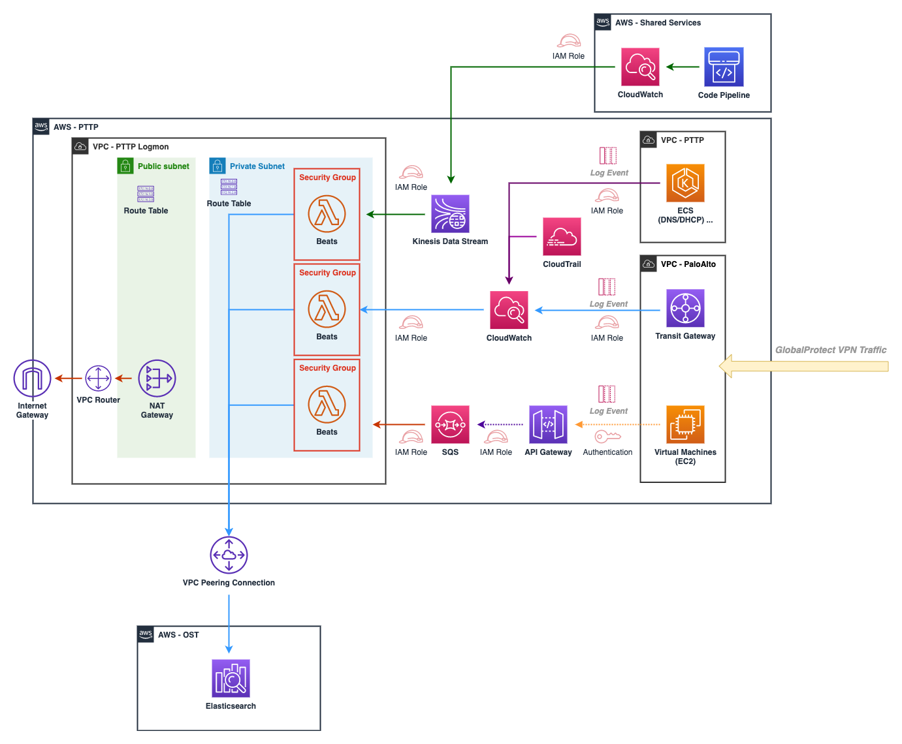

# Prison Technology Transformation Programme AWS Infrastructure

## Introduction

<!-- These maps to different accounts -->
<!-- Do we even need this section? -->

This project is a log-shipping platform for the Ministry of Justice.

## Architecture

[Source](diagrams/architecture.drawio)

The current environments are:

- Development
- Pre-production
- Production

<!-- Should this be in 2 seperate repos? -->

The Terraform in this repository serves 2 purposes:

<!-- is this really correct? -->

- (TODO: Flesh this out) Bootstrapping of Development, Pre-production and Production environments on AWS.

- Creating the infrastructure for log-shipping platform.

The Terraform in this repository can be run in 3 different contexts:

- Your own machine for bootstrapping AWS, or
- By releasing features through the CodePipeline in the Shared Services Account.
- Your own Terraform Workspace in the AWS Dev account.

## Pre-requisites

- [aws-vault](https://github.com/99designs/aws-vault) should be installed
- [Terraform](https://www.terraform.io/) should be installed (we recommend using a Terraform version manager such as [tfenv](https://github.com/tfutils/tfenv))
<!-- What about people who join the project who don't have access to this Slack channel? -->
- AWS account access to at least the `dev` and `shared services` accounts (ask in the channel `#moj-pttp` in Slack)

## Setup aws-vault

- `aws-vault add moj-pttp-dev` (this will prompt you for the values of your AWS Dev account)
- `aws-vault add moj-pttp-shared-services` (this will prompt you for the values of your AWS Shared Services account)

## Setup MFA

- Navigate to the AWS console for a given account
- Click on IAM under Services in the AWS console
- Click on 'Users' in the IAM menu
- Find your username within the list and click on it
- Select the security credentials tab and then assign an MFA device and select 'Virtual MFA device' (follow the on-screen instructions for this step)
- Edit your local `~/.aws/config` with the key value pair of `mfa_serial=<iam_role_from_mfa_device>`. This is in your User under Assigned MFA device. Ensure you remove '(Virtual)' from the key value pair

## Getting started

- `aws-vault exec moj-pttp-shared-services -- make init` (if you are prompted to bring across workspaces, say yes)
- `aws-vault exec moj-pttp-shared-services -- terraform workspace new <myname>` (replace `<myname>` with your own name)
- Run `aws-vault exec moj-pttp-shared-services -- terraform workspace list` and make sure that your new workspace with your name is selected
- If you don't see your new workspace selected, run `aws-vault exec moj-pttp-shared-services -- terraform workspace select <myname>`
- Create a `terraform.tfvars` in the root of the project and populate it with the values in examplevars, you can find a completed example of this in 1password7, in a vault named "PTTP". Update owner_email to your own email.
- Edit your aws config (usually found in `.aws/config`) to include the key value pair of `region=eu-west-2` for both the `profile moj-pttp-dev` and the `profile moj-pttp-shared-services` workspaces
- Run `aws-vault exec moj-pttp-shared-services -- terraform plan` and check that for an output. If it appears as correct terraform output, run `aws-vault exec moj-pttp-shared-services -- terraform apply`.

## Once you are done

- `aws-vault exec moj-pttp-shared-services -- terraform destroy` this will tear down the infrastructure in your workspace.

## Testing

There is a testing suite called Terratest that tests modules in this codebase
To run this codebase you will need to [install golang](https://formulae.brew.sh/formula/go)

To run the unit test run

- `cd test`
- `aws-vault exec pttp-development -- go test -v -timeout 30m`

To run a single unit test (in this case, one name "TestCloudTrailEventsAppearInCloudWatch"), run

- `cd test`
- `aws-vault exec moj-pttp-shared-services -- go test -v -run TestCloudTrailEventsAppearInCloudWatch`

## Modules

### CustomLoggingApi

This spins up an AWS API Gateway which is secured by an API key. JSON messages can be posted to the `/production/logs` endpoint
which will then be placed on an encrypted SQS queue to await further processing. The module provides four outputs:

- `logging_endpoint_path` - The full path to the logs endpoint on the API (Also exposed via `logging_api_endpoint_path` in the main outputs file for the project).
- `custom_logging_api_key` - The API key for the logging API. This should be provided to the API via the x-api-key header (also exposed via `logging_api_key`in the main outputs file for the project).
- `custom_log_queue_url` - The URL of the SQS queue onto which logs are placed.
- `custom_log_queue_arn` - The ARN of the SQS queue onto which logs are placed.

The API can be tested with the following curl command:

`curl -H "x-api-key: <custom_logging_api_key>" -H "Content-Type: application/json" -X POST <logging_endpoint_path> -d "{\"SomeKey\":\"SomeValue\"}"`

## Useful commands

- To log in to the browser-based AWS console using `aws-vault`, run either of the following commands:
  - `aws-vault login moj-pttp-dev` to log in to the dev account
  - `aws-vault login moj-pttp-shared-services` to log in to the shared services account

## Alarms

A number of alarms are configured to monitor the health of the log forwarding platform.
Alerting is done with SNS topics and subscriptions.
