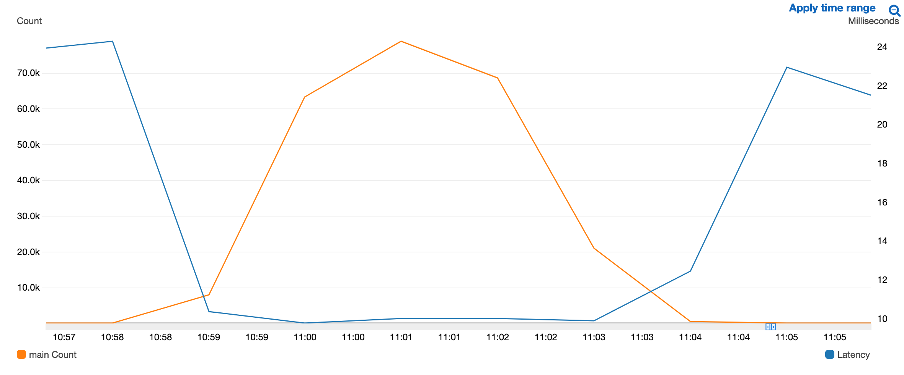
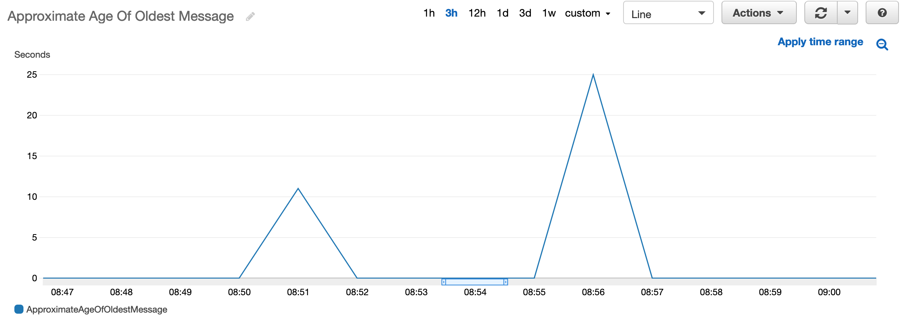
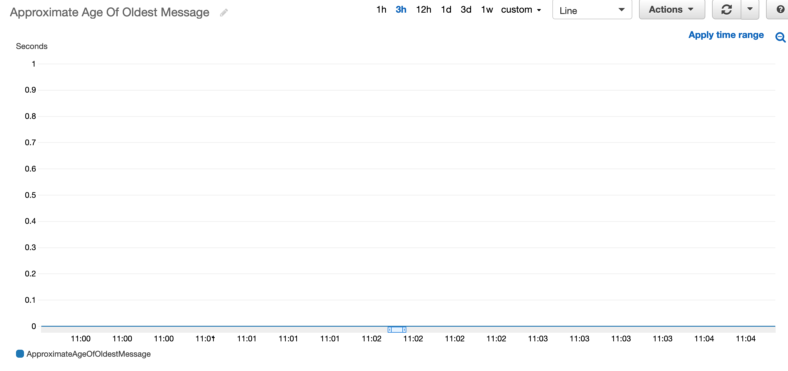
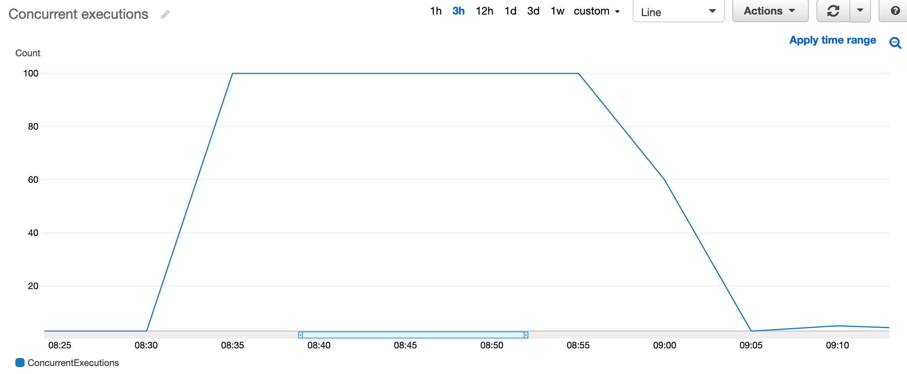
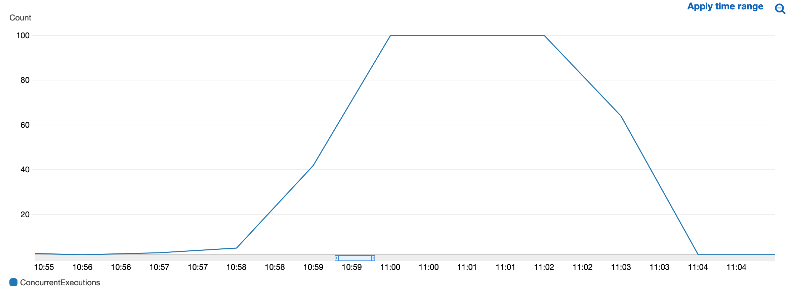
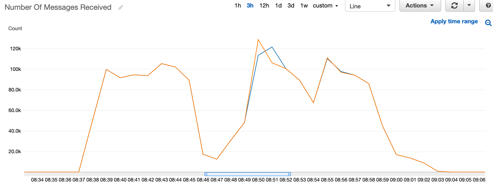

# Custom Logging API Load Test - 16th July 2020

## Introduction

We wanted to establish an upper threshold for the throughput of the custom logging API built as part of the logging solution. The following document explains our process, technologies used and concludes with our findings 

## Process

The process used for this performance test was relatively simple. Leveraging a load testing tool and combining this with our infrastructure-as-code approach, we were able to simulate large throughput on the system from multiple machines.

[ArtilleryJS](https://artillery.io/) was the chosen load testing tool, which has a couple of key parameters used to define test runs: arrival rate, and duration. 

* Arrival rate describes the number of new requests that will be made by the tool each second.

* Duration describes the number of seconds that the test run will last for. 

An arrival rate of 5 requests per second, and a duration of 10 seconds results in 50 requests being made overall.

Artillery processes were run simultaneously on multiple EC2 T2-Micro instances. These are programatically created and destroyed using Terraform. The EC2 instances are enabled using a flag that is injected by the CI pipeline via an environment variable. 

One point worth noting is that Terraform is unable to bring all EC2 instances up instantly. This means that while Artillery is configured to perform a test run lasting 1 minute, the actual run time, across all instances, will last longer than this. 

The total number of requests in a run is the product of the Artillery arrival rate, Artillery duration, and the number of EC2 instances spun up. The requests will be spread across 5 or 10 minutes as AWS infrastructure is created, with a surge in the middle when the majority of the instances come online.

Two sets of tests were run: 

* Test A: Initial run of 500 client instances with an arrival rate of 60 requests per second for a duration of 60 seconds. This equates to a total of 1.8 million requests over the course of the test. The parameters were found to be close to the maximum that could be achieved using EC2 T2-Micro instances through prior experimentation.

* Test B: Second run of 100 client instances with an arrival rate of 40 requests per second for 60 seconds, equating to 240 thousand requests over the course of the test. This was estimated to be the maximum sustainable throughput achievable given the observed average execution time of the lambda, and a concurrency limit set to 100 (the default limit) of simultaneous lambda invocations.

## Results

### API Gateway Requests and Latency

###### Test A:

###### Test B:

The above graphs show the time taken for the API gateway to process requests and add the logs that they contain to the queue. It’s interesting to note the initial latency on both test A and B. This is due to AWS automatically scaling to handle the increasing load. As the requests go above 1, the latency drops to between 1ms and 10ms over a 5-10 second period. Towards the end of the test there is a corresponding increase in latency.  During the load phase the highest latency is 25ms. The average latency during the spike is approximately 10ms which could be considered a normal baseline.

### Age of the Oldest Message in the Queue

###### Test A:

###### Test B:

The above graphs indicate the length of time a message stays in the queue before being processed by a lambda. It serves as a good indicator of how the logging solution is performing. The age of the oldest message is expected to remain constant and low when there is sufficient capacity to handle all incoming messages as seen in *test B*. In *Test A* the average age of the oldest message was up to 25 seconds. This is because the lambdas that read messages from the queue reach the concurrency limit and are unable to process logs as soon as they arrive. This is acceptable for short spikes in demand, as the queue will eventually be cleared. If we see that the age of the oldest message is not returning to a constant number then it is an indicator that more capacity is needed in the system.

### SQS Lambda Concurrent Executions

###### Test A:

###### Test B:

These charts show the number of concurrent lambda executions over the course of the tests. We can observe that both reach the concurrency limit of 100 (which is expected and desired behaviour - we always want to be processing as many messages in parallel as we can). It’s worth noting the difference in time between the two test runs however. Test A took significantly longer to process all the messages than in Test B. If there was no concurrency limit, we would expect both runs to take a similar amount of time (assuming test data could be generated fast enough).

### Messages Received and Sent on the Queue

###### Test A:

###### Test B:

These charts show the volume of messages arriving over the course of the tests. These match the number of requests hitting the API gateway for each test. The dip in the middle of Test A is due to limitations in how quickly Terraform  can create EC2 instances.

## Conclusion

Through testing, an approximate maximum sustained capacity for the logging system has been established.  In its current configuration it is able to 4k requests per second with a maximum latency of 25 milliseconds and no messages remaining on the queue for more than 1 second.

The system can handle significantly larger spikes of demand, but this can cause a backlog of messages that need to be processed. Monitoring the *approximate age of the oldest message* metric for the sqs queue for any sustained increases would alert us if the service became saturated.

Capacity can be tuned when production usage metrics exist. Calculations show that lambdas are able to process approximately 40 logs per second per concurrent instance. The concurrent cap can be adjusted as required.

